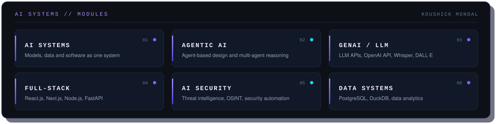
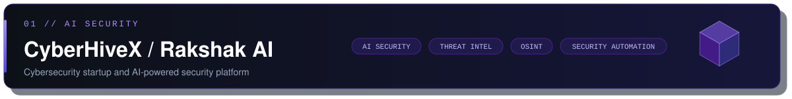
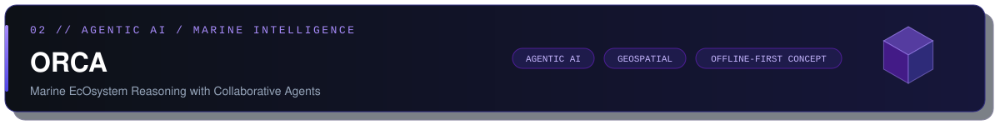
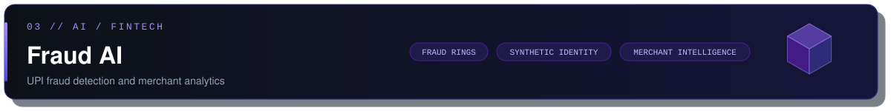
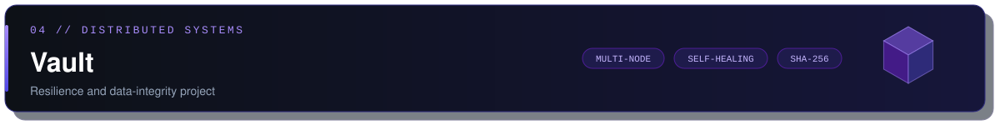
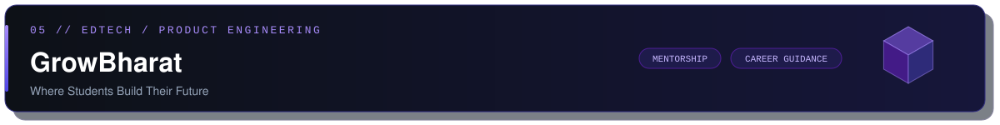
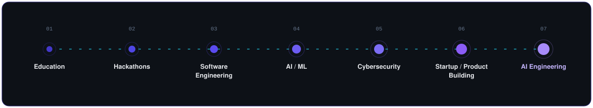

<div align="center">



<br>

<b>Building AI-powered systems, intelligent applications and security-focused products.</b>

<sub><code>B.Tech CSE · Lovely Professional University</code> &nbsp; <code>Kolkata, West Bengal, India</code></sub>

<br><br>

<a href="https://koushickmondal.vercel.app"></a>
<a href="https://www.linkedin.com/in/koushick-mondal"></a>
<a href="https://github.com/Koushick-Mondal"></a>
<a href="mailto:mondalkoushick393@gmail.com"></a>

</div>

---

## AI Engineer / Systems Builder

<div align="center">

</div>

<br>

I build AI-powered systems that connect models, data, software infrastructure and real-world workflows: a fraud-analytics project, a marine-intelligence agent platform, a fault-tolerance testing project and an AI security product. I'm a second-year B.Tech Computer Science student at Lovely Professional University and co-founder of **CyberHiveX Technologies**, and I'm looking for internships and early-career roles in **AI/ML, software engineering, full-stack development and cybersecurity**.

---

## AI Engineering

<table>
  <tr>
    <td width="50%" valign="top"><code>01</code> &nbsp;<b>GENERATIVE AI</b><br><sub>Building with LLM APIs and generative AI workflows. Completed a Udemy course on the OpenAI API, ChatGPT, Whisper and DALL·E.</sub></td>
    <td width="50%" valign="top"><code>02</code> &nbsp;<b>LLM APPLICATIONS</b><br><sub>Applications built around language models, including Infinity AI, a personal AI companion concept for career guidance and productivity.</sub></td>
  </tr>
  <tr>
    <td width="50%" valign="top"><code>03</code> &nbsp;<b>AGENTIC AI</b><br><sub>Agent-based architectures and collaborative reasoning with LangGraph. ORCA explores this through a proposed multi-agent design.</sub></td>
    <td width="50%" valign="top"><code>04</code> &nbsp;<b>APPLIED MACHINE LEARNING</b><br><sub>Fraud detection and anomaly-oriented analytics in Fraud AI, built with Python, DuckDB and Streamlit.</sub></td>
  </tr>
  <tr>
    <td width="50%" valign="top"><code>05</code> &nbsp;<b>AI SECURITY</b><br><sub>Threat intelligence, OSINT and security automation through Rakshak AI at CyberHiveX Technologies.</sub></td>
    <td width="50%" valign="top"><code>06</code> &nbsp;<b>DATA &amp; ANALYTICS</b><br><sub>Data analytics with Python, DuckDB and Power BI, backed by PostgreSQL, MySQL and MongoDB.</sub></td>
  </tr>
</table>

---

## Selected Engineering Projects

<a href="https://github.com/Koushick-Mondal/CyberHiveX"></a>

A cybersecurity-focused startup I co-founded. Rakshak AI is its AI-powered security platform focused on threat intelligence and security automation. &nbsp;**Repository:** [Koushick-Mondal/CyberHiveX](https://github.com/Koushick-Mondal/CyberHiveX)

<details open>
<summary><b>Case study</b></summary>

<br>

| | |
|:--|:--|
| **Problem** | Enterprise and MSME security teams need timely threat intelligence and automated security workflows. |
| **Solution** | An AI-powered platform bringing threat intelligence, automation and security investigation capabilities together. |
| **Engineering focus** | AI-assisted security, security automation, product development |
| **Technology / domain** | AI security · threat intelligence · OSINT · digital forensics · red teaming · incident response |
| **Status** | In active development; company website under development |

</details>

<br>



An agentic AI-powered marine intelligence platform/concept combining satellite Earth observation, oceanographic, weather and geospatial data into conversational, evidence-based insights.

<details open>
<summary><b>Case study</b></summary>

<br>

| | |
|:--|:--|
| **Problem** | Fishermen, researchers, coastal authorities, disaster agencies and maritime operators need evidence-based marine insights, often without continuous connectivity offshore. |
| **Current project concept** | Potential Fishing Zone insights · route safety · marine risk · weather and sea conditions · hazard alerts · geospatial intelligence · conversational AI · offline-first mobile concept using preloaded data |
| **Engineering focus** | Multi-agent reasoning, geospatial data, offline-first mobile design |
| **Proposed Architecture** | Next.js · React Native · FastAPI · LangGraph · Bhashini · Leaflet / Mapbox · FAISS / pgvector · PostGIS / H3 · Redis |
| **Status** | In development as a concept/platform. The proposed architecture is a design direction; implementation of individual components is not claimed. |

</details>

<br>

<a href="https://github.com/Koushick-Mondal/fraud-ai"></a>

An AI-powered UPI fraud detection and merchant analytics project. &nbsp;**Repository:** [Koushick-Mondal/fraud-ai](https://github.com/Koushick-Mondal/fraud-ai)

<details open>
<summary><b>Case study</b></summary>

<br>

| | |
|:--|:--|
| **Problem** | Digital payment ecosystems need ways to surface fraud rings, synthetic identities and high-risk merchants. |
| **Solution** | Analytics and detection workflows: fraud ring analysis, synthetic identity detection, high-risk merchant identification, KYC analytics, chargeback analytics and merchant intelligence. |
| **Engineering focus** | Applied ML, analytical data modelling, interactive dashboards |
| **Technology** | Python · Streamlit · DuckDB · AI/ML · Data Analytics |
| **Status** | Public repository available |

</details>

<br>



A distributed-systems / resilience project built around multi-node architecture, self-healing and SHA-256 integrity verification.

<details>
<summary><b>Case study</b></summary>

<br>

| | |
|:--|:--|
| **Problem** | Data must stay available and verifiably intact through node failures and shutdowns. |
| **Solution** | A multi-node architecture orchestrated with Docker Compose and backed by PostgreSQL, with self-healing / fault recovery and SHA-256 integrity verification. |
| **Engineering focus** | Fault tolerance, integrity verification, shutdown and failure testing |
| **Technology** | Docker · Docker Compose · PostgreSQL |
| **Status** | Resilience-testing project; not presented as production-scale infrastructure |

</details>

<br>



A student mentorship and career guidance platform aimed primarily at early-year college students.

<details>
<summary><b>Case study</b></summary>

<br>

| | |
|:--|:--|
| **Problem** | Early-year students often lack structured direction on skills, courses and career paths. |
| **Solution** | Career guidance, mentorship and course recommendations across Web Development, AI/ML, Cybersecurity, App Development, UI/UX, Data Science, Competitive Programming, Freelancing and Startup guidance. |
| **Engineering focus** | Product thinking and platform design for students |
| **Status** | In development |

</details>

---

## Tech Stack

<table>
  <tr>
    <td width="50%" valign="top"><b><code>LANGUAGES</code></b><br><b>Python</b> · C · C++ · Java · JavaScript · <b>TypeScript</b> · PHP</td>
    <td width="50%" valign="top"><b><code>AI / ML</code></b><br>AI · ML · <b>GenAI</b> · <b>LLMs</b> · AI Agents · <b>OpenAI API</b> · <b>LangGraph</b> · Data Analytics</td>
  </tr>
  <tr>
    <td width="50%" valign="top"><b><code>FRONTEND</code></b><br>HTML · CSS · React.js · <b>Next.js</b></td>
    <td width="50%" valign="top"><b><code>CYBERSECURITY</code></b><br>Cybersecurity · OSINT · Digital Forensics · Threat Intelligence · Red Teaming · Incident Response</td>
  </tr>
  <tr>
    <td width="50%" valign="top"><b><code>BACKEND</code></b><br>Node.js · <b>FastAPI</b> · PHP</td>
    <td width="50%" valign="top"><b><code>TOOLS</code></b><br>Git · GitHub · VS Code · Postman · Figma · Power BI · MS Office · Unix/Linux · Docker · Docker Compose</td>
  </tr>
  <tr>
    <td width="50%" valign="top"><b><code>DATABASES</code></b><br>MySQL · MongoDB · PostgreSQL · DuckDB</td>
    <td width="50%" valign="top"><b><code>CLOUD</code></b><br>Oracle Cloud Infrastructure · AWS Cloud Foundations</td>
  </tr>
</table>

---

## Engineering Journey

<div align="center">

</div>

---

## Experience

| Role | Organization | Focus |
|:--|:--|:--|
| **Co-founder** | CyberHiveX Technologies | Cybersecurity, AI security, threat intelligence, automation, OSINT and product development |
| **Full Stack Developer Intern** | Prashant Kumar LTD (Remote) | Full-stack development internship |
| **Official Ambassador** | ICPC Amritapuri Regionals 2026 | Institution-level ambassador |

## Community & Leadership

<sub>Student community and campus roles.</sub>

| Programme | Role |
|:--|:--|
| IIT Delhi | Campus Ambassador |
| Techfest, IIT Bombay | Campus Ambassador |
| IIT Kharagpur | Campus Ambassador |
| GeeksforGeeks | Campus Mantri |
| ECSoC 2026 | Campus Ambassador |
| iNSIGHTS 2026 | Student role |

---

## Engineering Milestones

<table>
  <tr>
    <td width="33%" valign="top"><b>Smart India Hackathon 2024</b><br><sub>Finalist · Team N.E.S.T. · PS 1545, non-electrical sun-tracking device</sub></td>
    <td width="33%" valign="top"><b>SIH 2024, internal competition</b><br><sub>1st Runner-Up</sub></td>
    <td width="33%" valign="top"><b>Naukri Campus Young Turks 2025</b><br><sub>99.51 percentile · AIR 2471</sub></td>
  </tr>
  <tr>
    <td width="33%" valign="top"><b>AINCAT 2026</b><br><sub>Qualified · AIR 2239</sub></td>
    <td width="33%" valign="top"><b>CodeFest'25 (IICPC)</b><br><sub>Prelims · Top 2K</sub></td>
    <td width="33%" valign="top"><b>Paytm Hackathon 2026</b><br><sub>Finale shortlist</sub></td>
  </tr>
  <tr>
    <td width="33%" valign="top"><b>Tata Imagination Challenge</b><br><sub>Round 2</sub></td>
    <td width="33%" valign="top"><b>Board2Code</b><br><sub>Top 5</sub></td>
    <td width="33%" valign="top"><b>Escape Da Vinci 2026</b><br><sub>Offline finale</sub></td>
  </tr>
</table>

---

## Certifications

| Provider | Credential |
|:--|:--|
| **Oracle** | Oracle Cloud Infrastructure 2025 Certified Foundations Associate |

## Courses & Training

| Provider | Course |
|:--|:--|
| **Udemy** | OpenAI API / ChatGPT / Whisper / DALL·E |
| **AWS** | AWS Cloud Practitioner Essentials |

---

## GitHub Analytics

<div align="center">


<br>


</div>

## Contribution Activity

<div align="center">

<picture>
  <source media="(prefers-color-scheme: dark)" srcset="https://raw.githubusercontent.com/Koushick-Mondal/Koushick-Mondal/output/github-snake-dark.svg" />
  <source media="(prefers-color-scheme: light)" srcset="https://raw.githubusercontent.com/Koushick-Mondal/Koushick-Mondal/output/github-snake.svg" />
  
</picture>

</div>

---

## Currently Building

```text
CURRENTLY BUILDING
> AI systems
> Agentic workflows
> Cybersecurity products
> Full-stack applications

CURRENTLY EXPLORING
> Generative AI
> LLM applications
> AI agents
> AI security
> Threat intelligence

OPEN TO
> AI/ML internships
> Software engineering opportunities
> Full-stack opportunities
> Cybersecurity opportunities
```

---

## Connect

<div align="center">

<a href="https://github.com/Koushick-Mondal"></a>
<a href="https://www.linkedin.com/in/koushick-mondal"></a>
<a href="https://koushickmondal.vercel.app"></a>
<a href="mailto:mondalkoushick393@gmail.com"></a>

<br><br>

<sub><i>"Simplicity is prerequisite for reliability." — Edsger W. Dijkstra</i></sub>


</div>
